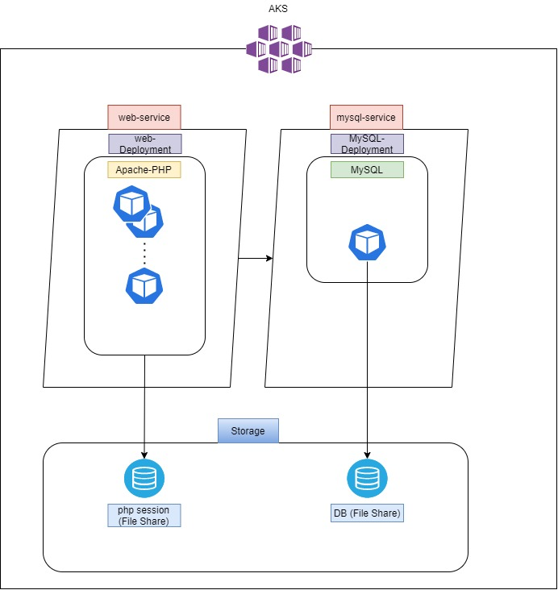

# LAMP-STACK-AKS

## 목적
LAMP Stack을 AKS 환경에 배포하며 쿠버네티스 환경 이해

1. 구조

    

2. 세팅 과정 요약

    1) Docker 이미지 생성   
       web - ubuntu, apache, php7 + source(blog)   
       db - MySQL 5.6 + DB data(blog)   
    2) 로컬 환경에서 테스트   
       Virtaul Box k8s Cluster에서 구축 후 curl로 정상 연동 확인   
    3) AKS 세팅   
       d2 3개 노드 세팅   
       Docker repo public(web,db) 사용하여 deployment, svc 세팅   
       테스트 결과 DB 데이터 안들어가있음 확인하여 별도로 import   
       (kubectl exec pod mysql -it -- mysql -u root -prP@ssw0rd blog < data.sql)   
    4) 최적화   
       DB PVC(File Share)   
       session PVC (File Share)   
3. Docker Image 작성
    1) Web - ubuntu, apache, php7 설치된 이미지를 pull한 후 /var/www/html 경로에 소스 추가 후 commit → tag → push 진행   
    2) DB - MySQL 5.6 이미지를 Pull한 후 DB 데이터 Import → commit → tag → push   
        → Data Import 해도 컨테이너에서 이미지로 사용 시 정상적으로 데이터를 불러오지 않음   
        → PVC로 변경
4. 적용 방법
    1) secret 생성   
        ```sh secret.sh```
    2) azure file 세팅   
       ```kubectl apply -f azure-file-sc.yaml```   
       ```kubectl apply -f azure-file-pvc.yaml```   
    3) web, db Deployment 및 Service 배포   
       ```kubectl apply -f web-db.yaml```   
    4) DB 데이터 삽입(예시)   
       ```kubectl get pod mysql-server```   
       mysql-server pod 확인
       ```kubectl exec mysql-server-675dcfd95b-zsz99 -it -- mysql -u root -prP@ssw0rd blog < data.sql```   
       DB명 blog가 없는 경우 생성한 후 진행
    5) 동작 확인   
       ```kubectl get svc```   
       blog-web의 EXTERNAL-IP 로 웹 접속   
       EXTERNAL-IP/admin 으로 관리자 계정 접속(admin/admin)   
       admin 하위 경로를 통해 기능 확인
    
